## Codebase for the agora android app.

I have used Native Java for development.

**I have used Retrofit for calling the signup and login API's. The API's that i have used are part of agora web api's.
I have tried to use OOP concepts wherever possible and documented the code efficiently.**

Also, the data in the application is all dummy and certain features like adding candidates in creating election, choosing algorithm are all hard coded and not functional. This prototype is made to demonstrate the UI aspect of every screen and basic functionalities like Login, Signup etc.

**The link for the video of the whole flow of the prototype on a live android design is given below:**

https://drive.google.com/file/d/1xZagRDk4iAhOXPovUwIhTXS0ROOUaaJC/view?usp=sharing

## Mockups For Android Development under Project Agora Web
I have created mockups regarding Issue #91

I have tried to keep the UI pretty simple yet very user friendly and tried to use maximum material design guidelines.The theme colours are choosed keeping in mind Agora Web Colours and even tried to incorporate your feedback on other requests as well.

Hoping to get the feedback from all the mentors and other people.

###### Splash Screen

Wen the app is opened this will be introductory splash screen with logo spinning in circular motion. It will check wether the user is signed in or not and will redirect to login page or dashboard page accordingly.

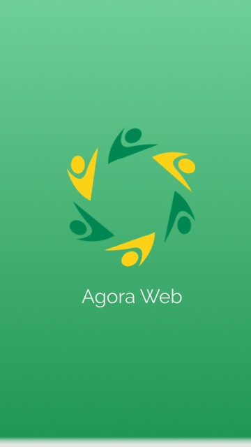

###### Login Page

The Login Page will have option of login through google, facebook and email. Used Agora colours all over

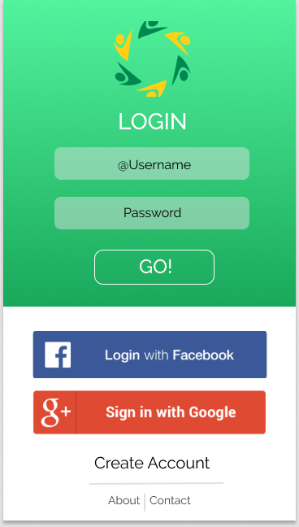

###### Register Page

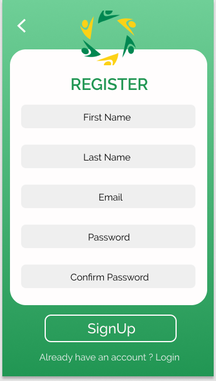

Once the registration is done a verification email will be sent to the user. We can use firebase auth for that.

###### Dashboard Page

On clicking on any of the card the corresponding elections page will be opened with data filtered according to the option clicked.

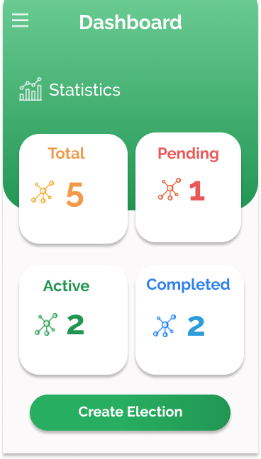

###### View Election 

User can add more number of candiates on this page by editing the election. 

###### Election Page

User can see the elections created by him with this screen and can edit them as well. By clicking on any election the view Election screen will be opened

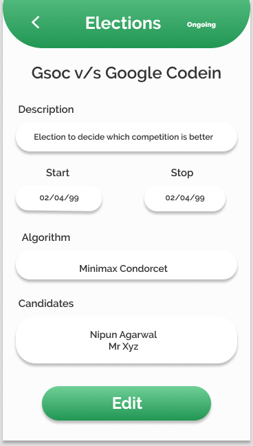

###### Completed Election

User can see the list of completed elections and result on this page.

.png)

###### Create Election

I have divided the process of creating election in multiple screens with total of 4 screens. Tried to follow the basic theming of colours and design everywhere.

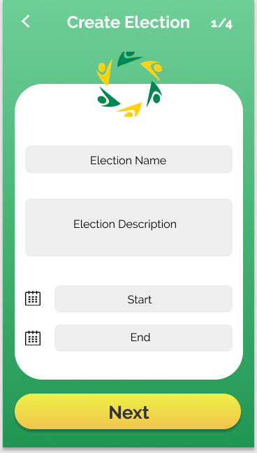    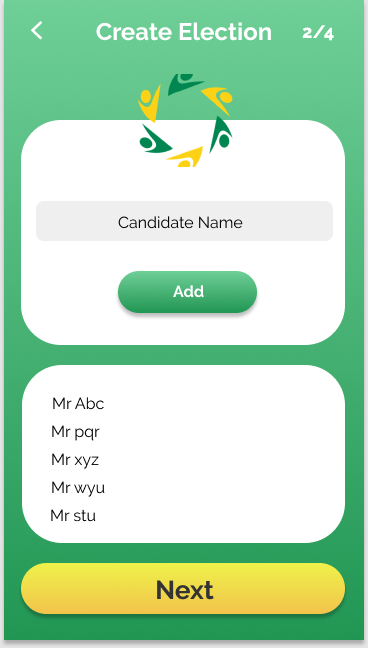

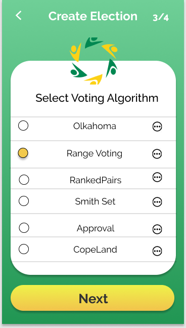    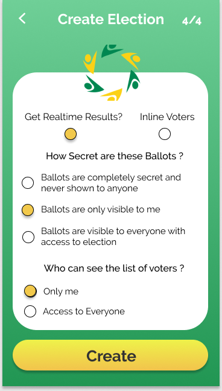

###### Eligible Voting Elections Screen

The elections that you are eligible to vote for will be visible on this screen.

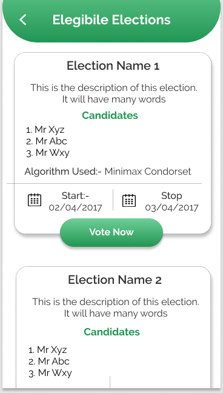

###### Cast Voting Screen (preferrential)

User can Cast vote through this screen.

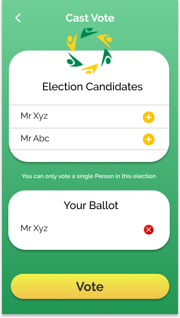

###### Cast Voitng Screen (range)

User can Cast vote through this screen by using range algorithm.

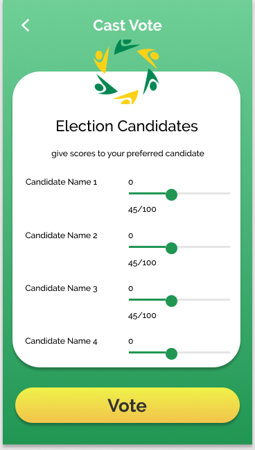

###### Cast Voitng Screen (range)

User can Cast vote through this screen by using score algorithm.

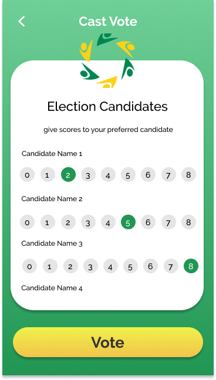

###### Side Nav Bar

This will have various options to navigate through the app

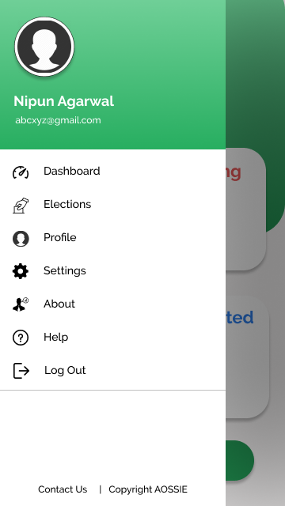

###### Profile

Profile section of the app with menu feautres of changing password, viewing your elections in recycler views and updating profile etc.

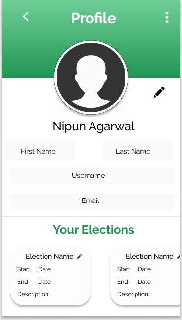

